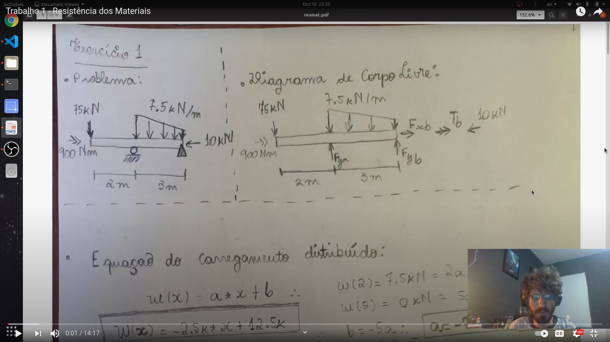
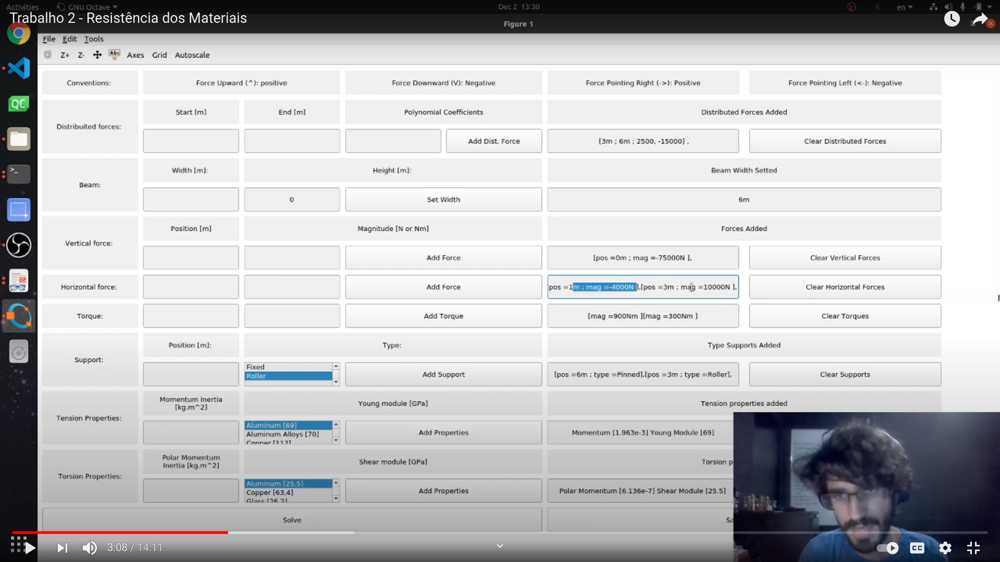
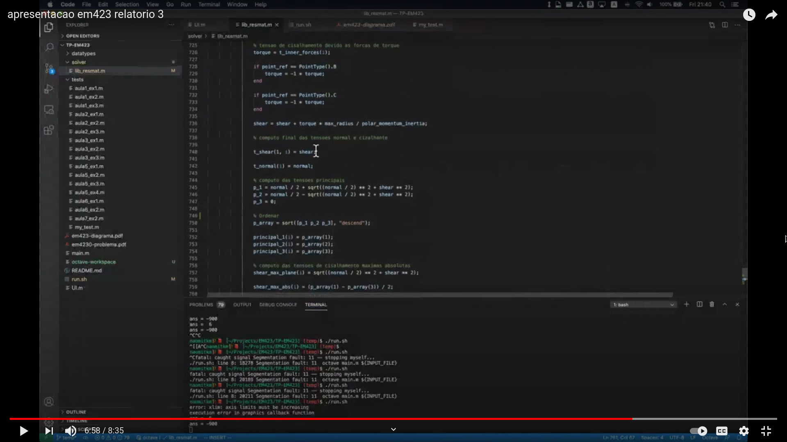
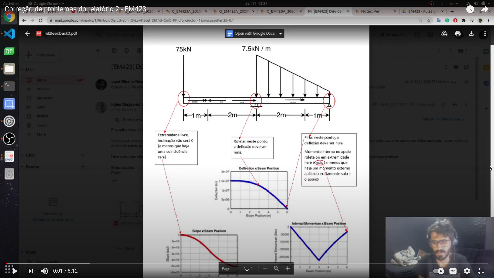
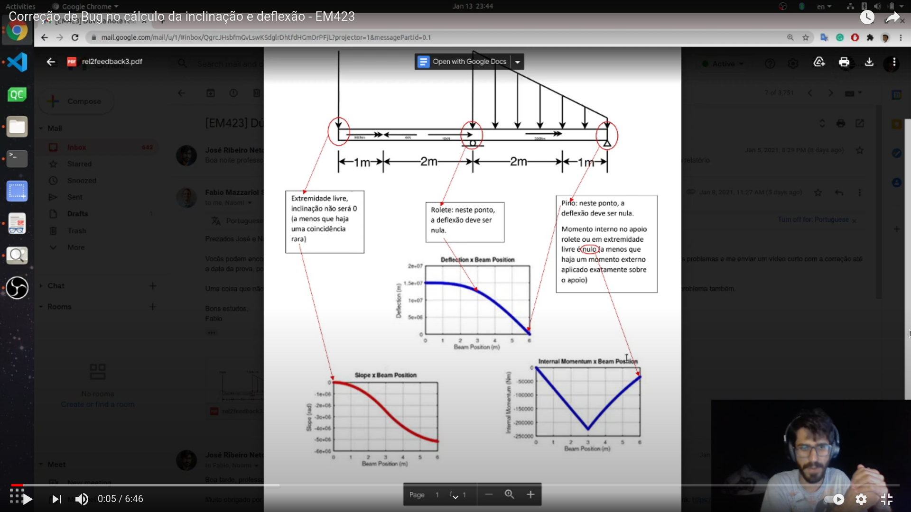

# TP-EM423
Trabalho prático da disciplina de resistência dos materiais (EM423).

* **Apresentação da parte 1 do projeto**

* **Apresentação da parte 2 do projeto**

* **Apresentação da parte 3 do projeto**

* **Correção de Bug de Momentos referente a parte 2**

* **Correção de Bug de Inclinação e Deflexão referente a parte 2**
